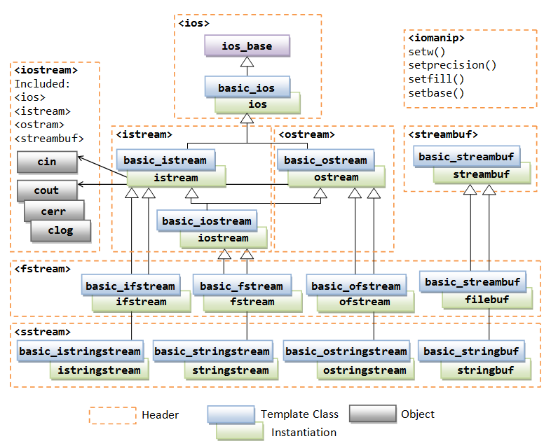

<#include meta/script.md>

---
title: "Maximal Script"
---

Inline code
===========

Exercise
--------

~~~ {.cpp}
int main() {
  char msg[10];
  char *p;
  char msg2[]= "Hello";

  msg = "Bonjour";
  p   = "Bonjour";

  msg = p;
  p = msg;
}
~~~

<#ifdef solution>

Solution
--------

~~~ {.cpp}
int main() {
  char msg[10]; // array of 10 chars
  char *p;      // pointer to a char
  char msg2[]= "Hello"; // msg2 = 'H''e''l''l''o''\0'

  // ERROR: cannot convert from 'const char [8]' to 'char [10]'
  msg = "Bonjour";

  // address of “Bonjour” goes into p
  p   = "Bonjour";

  // ERROR: cannot convert from 'char *' to 'char [10]'
  msg = p;

  // OK
  p = msg;
}
~~~

<#endif>

lstinputlisting
===============

Full
----

\lstinputlisting[language=C++]{code/src/main.cpp}

firstline & lastline
--------------------

\lstinputlisting[language=C++, firstline=6, lastline=8]{code/src/main.cpp}

linerange
---------

\lstinputlisting[language=C++, linerange={6-8}]{code/src/main.cpp}

\pagebreak

Images
======

Image drawio
------------

{height=75%}

Image direct
------------

{height=75%}

Image tikz
----------

{height=75%}

\pagebreak

Formulas
========

Die Multiplikation zweier Matrizen $A$ und $B$, $R = A \times B$ ist wie folgt definiert:
$r_{i,j} = \sum_{k=1}^{v} a_{i,k}b_{k,j}$,
wobei $A$ eine $u \times v$, $B$ eine $v \times w$ und $R$ eine $u \times w$ Matrix sind.

Zum Beispiel: $\begin{pmatrix}
a_{0,0} & a_{0,1} & a_{0,2} \\
a_{1,0} & a_{1,1} & a_{1,2} \\
\end{pmatrix} \times \begin{pmatrix}
b_{0,0} \\
b_{1,0} \\
b_{2,0} \\
\end{pmatrix} = \begin{pmatrix}
a_{0,0} \times b_{0,0} + a_{0,1} \times b_{1,0} + a_{0,2} \times b_{2,0} \\
a_{1,0} \times b_{0,0} + a_{1,1} \times b_{1,0} + a_{1,2} \times b_{2,0} \\
\end{pmatrix} = \begin{pmatrix}
r_{0,0} \\
r_{1,0} \\
\end{pmatrix}$
